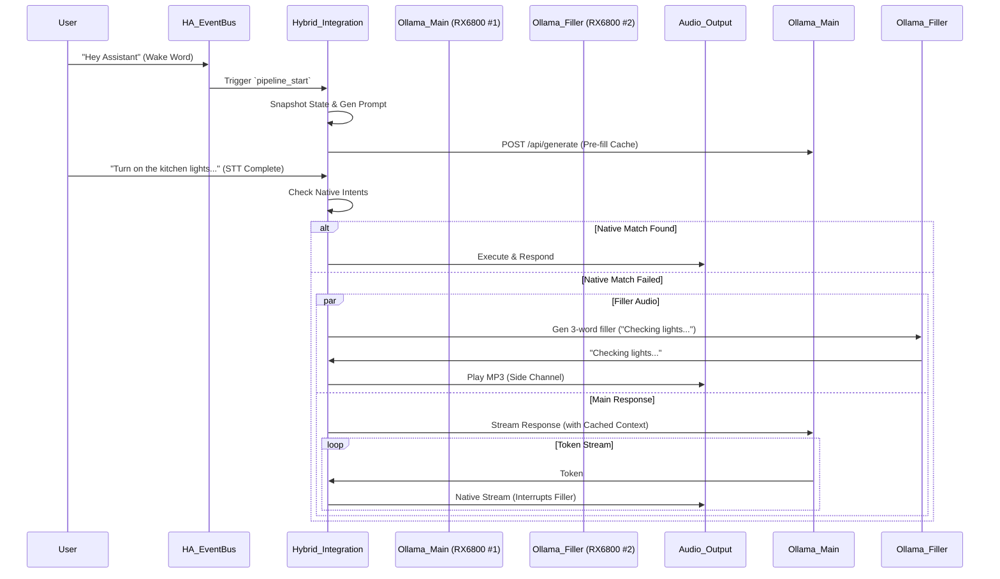

# Design Spec: Hybrid Local Voice Backend (Project `hybrid_llm`)

## 1. Executive Summary

This project aims to build a custom Home Assistant Conversation Agent that achieves sub-200ms perceived latency. It replaces the standard "blocking" pipeline with a **parallelized, state-aware architecture**.

**Key Innovations:**

1.  **Context Pre-warming:** The LLM context is generated and cached at the "Wake Word" event, not the "Speech Finished" event.
2.  **Hybrid Routing:** Prioritizes native HA intents (speed/accuracy) before falling back to LLM (intelligence).
3.  **Smart Filler (Side-Channel):** Uses a dedicated SLM (Small Language Model) to generate context-aware filler audio ("Checking that...") immediately upon native intent failure.
4.  **Native Streaming:** Leverages Home Assistant's native `async_process_streaming` (Oct 2025) to utilize Wyoming/Piper's TTS streaming capabilities.

---

## 2. Architecture

### 2.1 High-Level Flow



---

## 3. Implementation Specification

### 3.1 System Requirements

*   **Ollama Server:** Running locally or remotely.
*   **Ollama Config:**
    *   `OLLAMA_NUM_PARALLEL=2` (Recommended if using Filler Audio + Main Model simultaneously to prevent swapping).
    *   `OLLAMA_KEEP_ALIVE=5m` (Recommended to ensure context stays VRAM-resident between Wake Word and STT).

### 3.2 Component Structure

Location: `/config/custom_components/hybrid_llm/`

#### `manifest.json`

*   **Domain:** `hybrid_llm`
*   **Dependencies:** `conversation`, `media_player`
*   **Requirements:** `aiohttp`

#### `__init__.py` (The Cache Manager)

*   **Responsibility:** Listen for `assist_pipeline.pipeline_start`.
*   **Action:**
    1.  Extract `pipeline_execution_id`.
    2.  Generate full System Prompt + Entity State Dump.
    3.  Store pair `{id: prompt}` in `hass.data[DOMAIN]["cache"]`.
    4.  Send non-blocking request to Ollama Main Model (`max_tokens=1`) to force KV Cache ingestion.

#### `conversation.py` (The Router & Streamer)

* **Class:** `HybridConversationAgent`
* **Method:** `async_process_streaming` (Overrides native streaming method).
* **Logic:**
    1.  **Fast Path:** Call `intent.async_match`. If confidence > threshold, yield `FINAL_RESULT` immediately.
    2.  **Slow Path (Fallback):**
        * **Side Channel:** Immediately spawn async task to call Qwen-2-0.5B (Filler Model). Result is sent to `media_player.play_media` directly.
        * **Main Stream:** Retrieve cached prompt from `__init__.py`. Open stream to Main Model (Llama 3 / Gemma).
        * **Yielding:** Yield `ConversationResponseEventType.CONTENT` events. This triggers HA's internal TTS streaming, which will physically interrupt the Side Channel audio when the first audio chunk is ready.

---

## 4. Workflows & API Strategy

### 4.1 The "State Freeze" (Wake Word Logic)

* **Problem:** State changes between wake word and command completion (e.g., timestamps) invalidates LLM KV cache.
* **Solution:** The prompt sent at $T=0$ (Wake Word) is saved in memory. At $T=3$ (Command Received), the agent *must* use the saved string, not regenerate it.
* **Cache Key:** `user_input.context.id` (Correlates to Pipeline Run ID).

### 4.2 The "Smart Filler"

* **Model:** `qwen2:0.5b` (or `phi3:mini`).
* **Latency Budget:** < 300ms.
* **Prompt:** Single-shot. *"User said: '{text}'. Echo the subject with a 'checking' phrase. Max 4 words."*
* **Output:** Sent via `media_player.play_media`.
* **Behavior:** Fire-and-forget. We do not await this task. If the Main Model is faster (cached hit), the Native Stream will preempt the player, effectively skipping the filler.

### 4.3 Native Streaming Integration

* **Protocol:** Generator yielding `ConversationResponseEvent`.
* **TTS Provider:** Must use **Wyoming (Piper)** or Nabu Casa Cloud.
* **Mechanism:**

```python
yield conversation.ConversationResponseEvent(
    type=conversation.ConversationResponseEventType.CONTENT,
    data={"delta": token} 
)
```

---

## 5. Development Phases

### Phase 1: The Core Integration

* Scaffold `hybrid_llm`.
* Implement `async_process_streaming`.
* Implement basic "Native -> Fallback to Static Text" logic.

### Phase 2: The Pre-Warmer

* Implement `__init__.py` event listener.
* Implement "State Freeze" logic.
* Verify Ollama logs show "Cache Hit" on the second request.

### Phase 3: The Audio Layer

* Deploy `qwen2:0.5b` to Ollama.
* Implement the Side-Channel filler logic.
* Tune `OLLAMA_NUM_PARALLEL` to ensure Filler doesn't block Main.


### Phase 4: Configuration & Tool Use

* Implement `config_flow.py` (Ollama URL `CONF_URL` base, Main Model, Filler Model).
* Implement Home Assistant Tool Use (convert HA tools to Ollama Schema).
* Implement "Re-prompting Loop" for function calling.

### Phase 5: Refinement

* Implement System Prompt Templating (Jinja2).
* Implement Conversation History Management.
* Update Pre-warmer to use accurate templated state.

---

## 6. Installation (HACS)

1.  Add this repository as a Custom Repository in HACS.
2.  Install "Hybrid Local Voice Backend".
3.  Restart Home Assistant.
4.  Add Integration -> Hybrid LLM.

## 7. Known Risks & Mitigations

* **Ollama Race Condition:** If Filler and Main model try to load into the *same* GPU slot, swapping will occur (latency spike).
    * *Mitigation:* Explicitly verify `OLLAMA_NUM_PARALLEL` covers the count of models.
* **Device ID Mapping:** `user_input.device_id` refers to the microphone (e.g., ESP32 satellite).
    * *Mitigation:* Helper function to scan Device Registry and find the `media_player` entity linked to the same physical device.
